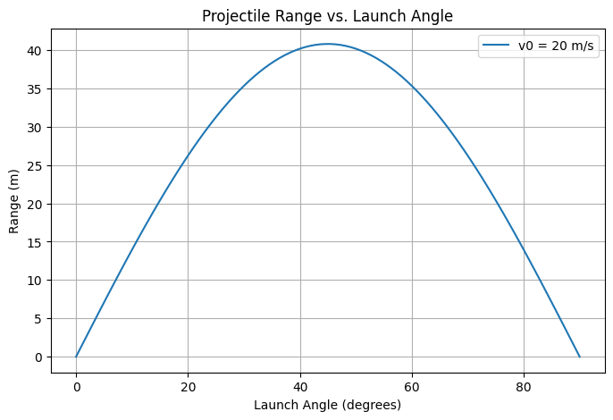
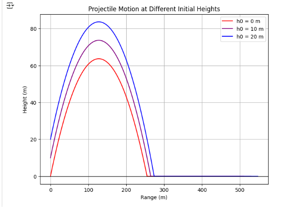
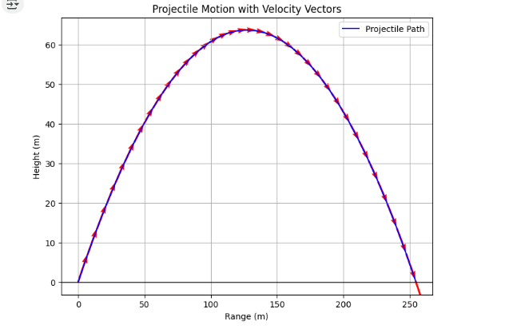
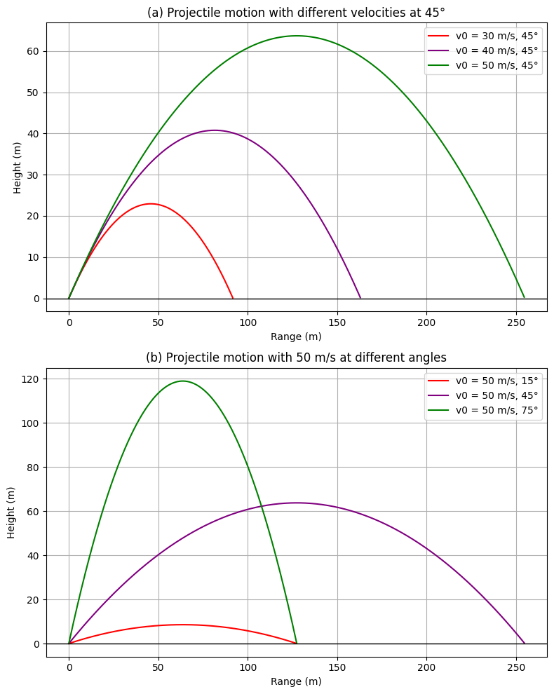

# Problem 1
## Projectile Motion: Analysis of Range Dependence on Launch Angle

### **1. Theoretical Foundation**
Projectile motion is governed by Newton’s laws. Assuming no air resistance, the motion can be described using kinematic equations:

- Horizontal motion:

$$
x = v_0 \cos(\theta) t
$$

- Vertical motion:
  $$
  y = v_0 \sin(\theta) t - \frac{1}{2} g t^2 
  $$

The total time of flight is found by solving for when the projectile returns to its initial height:

$$
 t_f = \frac{2 v_0 \sin(\theta)}{g} 
 $$
The horizontal range is given by:

$$
R = \frac{v_0^2 \sin(2\theta)}{g} 
$$

### **2. Analysis of the Range**
The horizontal range depends on:

- **Launch Angle (θ):** The range is maximized at 

$$
 45^\circ 
 $$

- **Initial Velocity 

$$
( v_0 )
$$

:** Higher velocity increases range quadratically.

- **Gravitational Acceleration (g):** A stronger gravitational field decreases range.

### **3. Practical Applications**
- **Sports:** Understanding ball trajectories in football and basketball.
- **Engineering:** Designing projectile-based systems like rockets or artillery.
- **Astrophysics:** Studying planetary motion under different gravity levels.

### **4. Implementation: Python Simulation**
We use Python to visualize how range varies with launch angle.

```python
import numpy as np
import matplotlib.pyplot as plt

def projectile_range(v0, g):
    angles = np.linspace(0, 90, 100)  # Angles in degrees
    angles_rad = np.radians(angles)   # Convert to radians
    ranges = (v0**2 * np.sin(2 * angles_rad)) / g
    
    plt.figure(figsize=(8,5))
    plt.plot(angles, ranges, label=f'v0 = {v0} m/s')
    plt.xlabel('Launch Angle (degrees)')
    plt.ylabel('Range (m)')
    plt.title('Projectile Range vs. Launch Angle')
    plt.legend()
    plt.grid()
    plt.show()

# Example parameters
v0 = 20  # Initial velocity in m/s
g = 9.81 # Gravity in m/s^2
projectile_range(v0, g)
```




### **5. Discussion on Limitations**
- **Air Resistance:** In real scenarios, drag significantly reduces range.
- **Uneven Terrain:** Changes in landing elevation affect results.
- **Wind Influence:** Can alter trajectory unpredictably.

### **Conclusion**
This analysis demonstrates the relationship between launch angle and range, emphasizing its significance in various real-world applications. Future studies can incorporate drag forces for more realistic modeling.


# 🚀 Why is the Maximum Range Achieved at a 45° Angle?

## 📌 Range Formula and Maximum Point
The total horizontal distance (**range**) covered by a projectile depends on the launch angle and is given by:

$$
R = \frac{v_0^2 \sin(2\theta)}{g}
$$

Where:
- **R** = Range (total horizontal distance covered)
- **v₀** = Initial velocity
- **θ** = Launch angle
- **g** = Gravitational acceleration
- **sin(2θ)** = Function determining the impact of angle on range

To achieve maximum range, **the function sin(2θ) must be maximized**. In mathematics, **sin(x) reaches its maximum value when it equals 1**, meaning:

$$
\sin(2\theta) = 1 \Rightarrow 2\theta = 90
$$

From this:

$$
\theta = 45
$$

 **Conclusion:** **The maximum range is achieved at a 45° launch angle!**

---

##  Why Are Lower and Higher Angles Worse?
Let's analyze how a projectile behaves at different angles:

### 🔻 Lower Angles (0° - 45°)
- **More horizontal velocity but weaker vertical motion.**
- The projectile falls quickly to the ground, reducing range.
- For example, **a launch at 30° provides some range but falls short due to early descent.**

### 🔺 Higher Angles (45° - 90°)
- **More vertical velocity but less horizontal velocity.**
- The projectile reaches a higher altitude but does not travel far.
- For instance, **a launch at 60° results in a longer air time, but the horizontal distance is shorter due to reduced horizontal speed.**

📌 **The 45° angle provides the best balance!**

---

##  Interesting and Fun Facts

###  **The 45° Rule in Sports**
- In sports like football, basketball, or tennis, **players aim for a 45° angle to maximize projectile distance**.
- However, due to air resistance, an optimal angle in practice is usually around **40° - 43°**.

###  **NASA and Rocket Science**
- Space rockets **are not launched at exactly 45°** because they need to escape the atmosphere efficiently.
- However, **artillery shells and short-range missiles** often use the 45° angle for maximum range!

###  **Archery and Ballistic Missiles**
- Archers **aim close to 45° when trying to achieve the longest possible shot**.
- Military artillery **uses this angle to maximize impact distance**.

---

##  Python Simulation: Effect of Angle on Range
The following Python code calculates the range for different angles and plots the results:

```python
import numpy as np
import matplotlib.pyplot as plt

def projectile_range(v0, g):
    angles = np.linspace(0, 90, 100)
    angles_rad = np.radians(angles)
    ranges = (v0**2 * np.sin(2 * angles_rad)) / g
    
    plt.figure(figsize=(8,5))
    plt.plot(angles, ranges, label=f'v0 = {v0} m/s', color='b')
    plt.axvline(45, color='r', linestyle='--', label='Maximum Range: 45°')
    plt.xlabel('Launch Angle (degrees)')
    plt.ylabel('Range (meters)')
    plt.title('Projectile Range vs. Launch Angle')
    plt.legend()
    plt.grid()
    plt.show()

# Example parameters
v0 = 20  # Initial velocity (m/s)
g = 9.81 # Gravitational acceleration (m/s²)
projectile_range(v0, g)
```

### 📈 What Will the Graph Show?

- **X-axis**: Launch angle (in degrees)
- **Y-axis**: Range (in meters)
- **Red dashed line**: Maximum range at 45°
- **Blue curve**: Effect of angle on range

---

##  CONCLUSION
 **The 45° angle is the ideal angle for maximum range!**
 **It provides the best balance between horizontal and vertical velocity.**
 **In real-world scenarios, air resistance can slightly modify the optimal angle.**
 **Used in physics, sports, military engineering, and rocket science!** 🎯🔥


## Yatay Hareket / Horizontal Movement
- If there is no friction, the speed remains constant.

## Dikey Hareket / Vertical Movement
- Speed decreases due to gravity and then reverses.

As a result, the object follows a parabolic path and falls to the ground after traveling a certain distance.

In this work, we examine the relationship between the launch angle and the distance reached by the object.

Our goal is to find out how far the object travels and discover which angle provides the best range.

### The important factors are:
1. Throw angle affects range!
2. As speed increases, so does range.
3. For best range, we should select forty-five degrees ($45^\circ$).  
   - The $45^\circ$ angle best balances both horizontal and vertical movement and provides the longest range.

```python

import numpy as np
import matplotlib.pyplot as plt

# Constants
g = 9.81  # Gravitational acceleration (m/s^2)
v0 = 800  # Bullet initial velocity (m/s)
angles = np.arange(10, 21, 2)  # Shooting angles (between 10° and 20° with 2° increments)

# Function to calculate range

def calculate_range(v0, angle):
    theta = np.radians(angle)
    return (v0 ** 2) * np.sin(2 * theta) / g

# Calculate range for given angles
ranges = [calculate_range(v0, angle) for angle in angles]

# Plot the graph


plt.figure(figsize=(8, 5))
plt.plot(angles, ranges, marker='o', linestyle='-', color='b', label='Bullet Range')
plt.xlabel('Shooting Angle (°)')
plt.ylabel('Range (m)')
plt.title('Range vs. Shooting Angle')
plt.legend()
plt.grid()
plt.show()

```


### Differential Equations of Bullet Motion

Bullet motion can be modeled in two dimensions:

1. **Horizontal motion:**

   $$
    \frac{dx}{dt} = v_x = v_0 \cos(\theta) 
    $$


2. **Vertical motion:**

   $$
    \frac{dy}{dt} = v_y 
    $$

   $$
    \frac{dv_y}{dt} = -g 
    $$

Where:
-  x \) and \( y \) are the position coordinates of the bullet.
- \( v_x \) and \( v_y \) are the horizontal and vertical velocity components, respectively.
- \( g \) is the gravitational acceleration.
- \( \theta \) is the shooting angle.

To solve these differential equations, numerical methods (such as the Euler method) can be used.


```python

import numpy as np
import matplotlib.pyplot as plt

def projectile_motion(v0, theta, h0, g=9.81, dt=0.01):
    theta = np.radians(theta)
    v0x = v0 * np.cos(theta)
    v0y = v0 * np.sin(theta)
    
    t_flight = (v0y + np.sqrt(v0y**2 + 2 * g * h0)) / g * 2
    t = np.arange(0, t_flight, dt)
    
    x = v0x * t
    y = h0 + v0y * t - 0.5 * g * t**2
    y = np.maximum(y, 0)  # Ensure it doesn't go below ground

    return x, y

# Define initial velocities, angles, and launch heights
v0 = 50  # Initial velocity in m/s
theta = 45  # Launch angle in degrees
heights = [0, 10, 20]  # Different launch heights

# Plot the projectile motion for different launch heights
plt.figure(figsize=(8, 6))
colors = ['red', 'purple', 'blue']

for h, color in zip(heights, colors):
    x, y = projectile_motion(v0, theta, h)
    plt.plot(x, y, label=f"h0 = {h} m", color=color)

plt.axhline(0, color='black', linewidth=1)  # Ground line
plt.xlabel("Range (m)")
plt.ylabel("Height (m)")
plt.title("Projectile Motion at Different Initial Heights")
plt.legend()
plt.grid()
plt.show()

```




```python

import numpy as np
import matplotlib.pyplot as plt

def projectile_motion(v0, theta, g=9.81, dt=0.01):
    """Compute projectile motion given initial velocity and angle."""
    theta = np.radians(theta)
    v0x = v0 * np.cos(theta)
    v0y = v0 * np.sin(theta)
    
    t_flight = (2 * v0y) / g
    t = np.arange(0, t_flight, dt)
    
    x = v0x * t
    y = v0y * t - 0.5 * g * t**2
    
    return x, y

# Define initial velocities and angles for both plots
velocities_a = [30, 40, 50]
angles_a = [45, 45, 45]

velocities_b = [50, 50, 50]
angles_b = [15, 45, 75]

# Create figure and subplots
fig, axs = plt.subplots(2, 1, figsize=(8, 10))
colors = ['red', 'purple', 'green']

def plot_projectiles(ax, velocities, angles, colors):
    for v0, theta, color in zip(velocities, angles, colors):
        x, y = projectile_motion(v0, theta)
        ax.plot(x, y, color=color, label=f'v0 = {v0} m/s, {theta}°')
    ax.axhline(0, color='black', linewidth=1)  # Ground line
    ax.set_xlabel("Range (m)")
    ax.set_ylabel("Height (m)")
    ax.legend()
    ax.grid()

# Plot (a)
plot_projectiles(axs[0], velocities_a, angles_a, colors)
axs[0].set_title("(a) Projectile motion with different velocities at 45°")

# Plot (b)
plot_projectiles(axs[1], velocities_b, angles_b, colors)
axs[1].set_title("(b) Projectile motion with 50 m/s at different angles")

plt.tight_layout()
plt.show()

```







