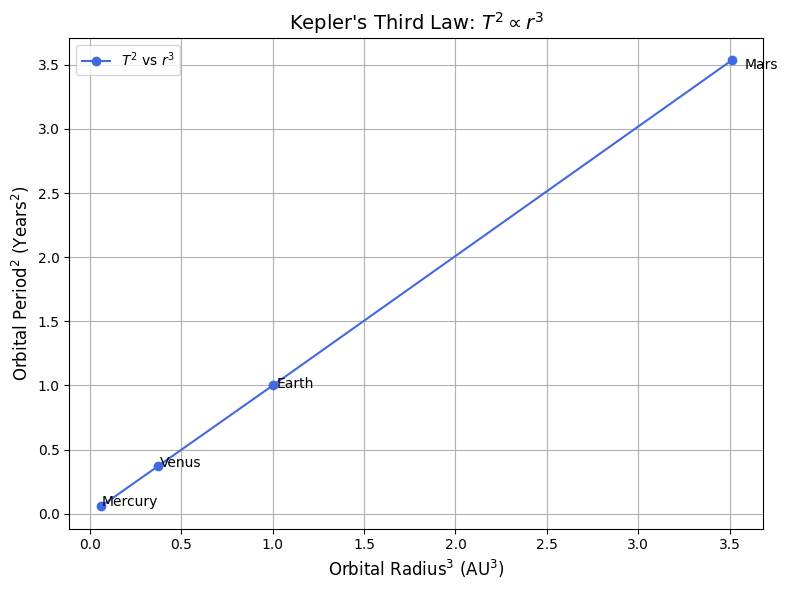
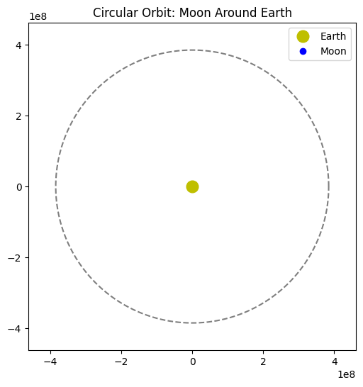

# Problem 1
# # Orbital Period and Orbital Radius

## Motivation
Kepler's Third Law reveals a powerful and elegant relationship between the time a planet takes to complete an orbit (its orbital period) and its average distance from the body it orbits (orbital radius). This relationship helps astronomers estimate distances in the Solar System and beyond, calculate masses of planets and stars, and understand orbital dynamics.

## Derivation of Kepler's Third Law for Circular Orbits

For a body of mass `m` orbiting a much larger mass `M` (like a planet around the Sun), the centripetal force is provided by gravity:

**Gravitational Force = Centripetal Force**

$$
 \frac{GMm}{r^2} = \frac{mv^2}{r} 
 $$

Solving for orbital velocity `v`:

$$
 v = \sqrt{\frac{GM}{r}} 
 $$

The orbital period `T` is the time it takes to make one full orbit:

$$
 T = \frac{2\pi r}{v} = \frac{2\pi r}{\sqrt{\frac{GM}{r}}} = 2\pi \sqrt{\frac{r^3}{GM}} 
 $$

Squaring both sides:

$$
 T^2 = \frac{4\pi^2}{GM} r^3 
 $$

Thus:

$$
 T^2 \propto r^3 
 $$

This is Kepler's Third Law.

## Implications in Astronomy
- Helps determine the mass of celestial bodies.
- Allows estimation of distances between planets and stars.
- Provides a method for understanding satellite trajectories.

## Real-World Examples

### 1. Moon's Orbit Around Earth
```python
import numpy as np
import matplotlib.pyplot as plt

# Constants
G = 6.67430e-11  # m^3 kg^-1 s^-2
M_earth = 5.972e24  # kg
r_moon = 384400e3  # m

# Calculate orbital period
T_moon = 2 * np.pi * np.sqrt(r_moon**3 / (G * M_earth))
T_moon_days = T_moon / (60 * 60 * 24)
print(f"Orbital Period of Moon: {T_moon_days:.2f} days")
```

Orbital Period of Moon: 27.45 days


## Extension to Elliptical Orbits
Kepler's Third Law also applies to elliptical orbits when using the semi-major axis `a` instead of radius `r`:

$$
 T^2 = \frac{4\pi^2}{GM} a^3 
 $$

This version holds true for all elliptical orbits, making the law universally applicable to binary stars, moons, and exoplanets.

---
**Conclusion:**
Kepler's Third Law connects orbital periods and radii through gravity's universal law. Whether examining artificial satellites or exoplanets, this principle guides modern astronomy and space science.

### 2. Planets in the Solar System

```python
import numpy as np
import matplotlib.pyplot as plt

# Orbital radius in AU and orbital period in years for selected planets
radii_au = np.array([0.39, 0.72, 1.0, 1.52])  # Mercury to Mars
periods_years = np.array([0.24, 0.61, 1.0, 1.88])
planet_names = ['Mercury', 'Venus', 'Earth', 'Mars']

# Calculate r^3 and T^2
r_cubed = radii_au**3
T_squared = periods_years**2

# Plotting
plt.figure(figsize=(8, 6))
plt.plot(r_cubed, T_squared, 'o-', color='royalblue', label=r"$T^2$ vs $r^3$")

# Annotate each point with the planet name
for i, name in enumerate(planet_names):
    plt.text(r_cubed[i] * 1.02, T_squared[i] * 0.98, name, fontsize=10)

plt.xlabel(r"Orbital Radius$^3$ (AU$^3$)", fontsize=12)
plt.ylabel(r"Orbital Period$^2$ (Years$^2$)", fontsize=12)
plt.title("Kepler's Third Law: $T^2 \propto r^3$", fontsize=14)
plt.grid(True)
plt.legend()
plt.tight_layout()
plt.show()
```



```python
import numpy as np
import matplotlib.pyplot as plt
from matplotlib.animation import FuncAnimation

# Constants
r = 384400e3  # Radius of Moon's orbit in meters
T = 27.3 * 24 * 3600  # Period in seconds

# Time values
n_frames = 200
time_vals = np.linspace(0, T, n_frames)

# Orbital position calculations
x_vals = r * np.cos(2 * np.pi * time_vals / T)
y_vals = r * np.sin(2 * np.pi * time_vals / T)

# Set up the plot
fig, ax = plt.subplots(figsize=(6, 6))
ax.set_xlim(-1.2*r, 1.2*r)
ax.set_ylim(-1.2*r, 1.2*r)
ax.set_aspect('equal')
ax.plot(0, 0, 'yo', markersize=12, label='Earth')
orbit_path, = ax.plot([], [], 'k--', alpha=0.5)
moon, = ax.plot([], [], 'bo', label='Moon')

def init():
    orbit_path.set_data(x_vals, y_vals)
    moon.set_data([], [])
    return orbit_path, moon

def update(frame):
    moon.set_data(x_vals[frame], y_vals[frame])
    return moon,

ani = FuncAnimation(fig, update, frames=n_frames, init_func=init, blit=True)
plt.title("Circular Orbit: Moon Around Earth")
plt.legend()
plt.show()
```

## Simulation of Circular Orbits



```python
# Linear regression (for illustrative best-fit)
from scipy.stats import linregress

slope, intercept, r_value, _, _ = linregress(r_cubed, T_squared)
fit_line = slope * r_cubed + intercept

plt.figure(figsize=(8, 6))
plt.plot(r_cubed, T_squared, 'o', label="Observed")
plt.plot(r_cubed, fit_line, '-', label=f"Best Fit: $T^2 = {slope:.2f}r^3 + {intercept:.2f}$")
plt.xlabel(r"Orbital Radius$^3$ (AU$^3$)")
plt.ylabel(r"Orbital Period$^2$ (Years$^2$)")
plt.title("Kepler's Third Law Linear Fit")
plt.legend()
plt.grid(True)
plt.tight_layout()
plt.show()
```

## 📐 Deriving Masses Using Kepler’s Law
# 🌌 Kepler’s Third Law: Deriving the Mass of Earth and the Sun

## ⚙️ Kepler’s Third Law (Circular Orbits)

Starting from Newton’s law of gravitation and centripetal force:

$$
\frac{GMm}{r^2} = \frac{mv^2}{r}
$$

Solving for orbital velocity:

$$
v = \sqrt{\frac{GM}{r}}
$$

Orbital period:

$$
T = \frac{2\pi r}{v} = 2\pi \sqrt{\frac{r^3}{GM}}
$$

Squaring both sides:

$$
T^2 = \frac{4\pi^2}{GM} r^3
$$

Rearranging to solve for the central mass $M$:

$$
M = \frac{4\pi^2 r^3}{G T^2}
$$

---

## 🌍 1. Deriving Earth's Mass (Using the Moon’s Orbit)

**Given:**

- Orbital radius of the Moon:  
  $$ r = 384{,}400 \times 10^3 \, \text{m} $$
- Orbital period of the Moon:  
  $$ T = 27.3 \times 24 \times 3600 \, \text{s} $$
- Gravitational constant:  
  $$ G = 6.67430 \times 10^{-11} \, \text{m}^3 \, \text{kg}^{-1} \, \text{s}^{-2} $$

**Calculation:**

$$
M_{\text{Earth}} = \frac{4\pi^2 r^3}{G T^2}
$$

**Result:**

$$
M_{\text{Earth}} \approx 5.97 \times 10^{24} \, \text{kg}
$$

---

## ☀️ 2. Deriving the Sun’s Mass (Using Earth’s Orbit)

**Given:**

- Orbital radius of Earth:  
  $$ r = 1.496 \times 10^{11} \, \text{m} $$
- Orbital period of Earth:  
  $$ T = 365.25 \times 24 \times 3600 \, \text{s} $$
- Same gravitational constant $G$

**Calculation:**

$$
M_{\text{Sun}} = \frac{4\pi^2 r^3}{G T^2}
$$

**Result:**

$$
M_{\text{Sun}} \approx 1.99 \times 10^{30} \, \text{kg}
$$

---

## ✅ Summary Table

| Celestial Body | Orbital Radius ($r$)         | Orbital Period ($T$)         | Calculated Mass ($M$) |
|----------------|-------------------------------|-------------------------------|------------------------|
| Earth (via Moon) | $3.844 \times 10^8$ m        | 27.3 days                     | $5.97 \times 10^{24}$ kg |
| Sun (via Earth) | $1.496 \times 10^{11}$ m     | 365.25 days                   | $1.99 \times 10^{30}$ kg |

---

Kepler’s Third Law, when combined with Newton’s law of gravitation, allows us to determine the mass of celestial bodies from orbital data. This fundamental principle underpins modern astrophysics and orbital mechanics.


