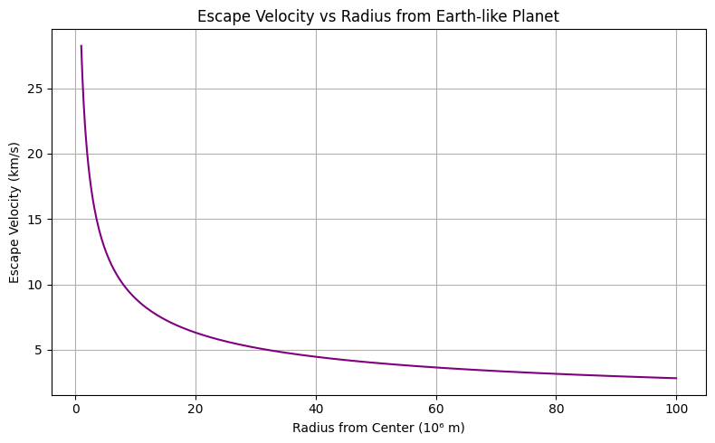
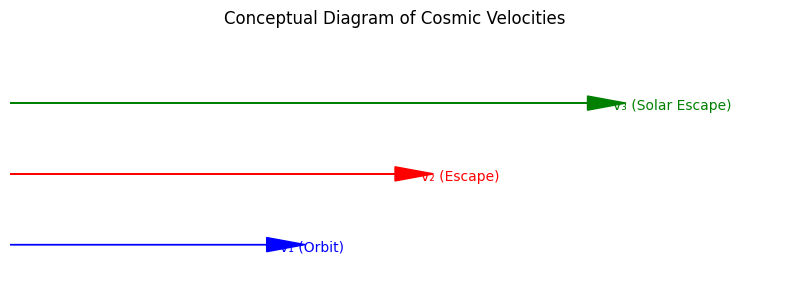

# Problem 2
# # Escape Velocities and Cosmic Velocities

## Motivation
Understanding the concept of escape velocity is essential in astrophysics and space engineering. It defines the minimum speed an object must reach to break free from a celestial body's gravitational influence. The three cosmic velocities categorize different thresholds: reaching orbit (first), escaping the planet (second), and escaping the entire star system (third). These concepts guide space missions, from launching satellites to interstellar exploration.

---

## Definitions

- **First Cosmic Velocity (v₁)**: Minimum velocity to maintain a stable circular orbit around a body.
  
  $$
   v_1 = \sqrt{\frac{GM}{r}} 
   $$

- **Second Cosmic Velocity (v₂)**: Minimum velocity to escape the gravitational pull of a body (escape velocity).
  
  $$
   v_2 = \sqrt{2} \cdot v_1 = \sqrt{\frac{2GM}{r}} 
   $$

- **Third Cosmic Velocity (v₃)**: Minimum velocity to escape the gravitational influence of the entire solar system from Earth's surface, assuming the spacecraft is not assisted by other celestial bodies.
  
  $$
   v_3 \approx 16.7 \text{ km/s (from Earth)} 
   $$

---

## Mathematical Derivation
Starting with energy conservation:

Total energy at escape = 0:

$$
 \frac{1}{2}mv^2 - \frac{GMm}{r} = 0 \Rightarrow v = \sqrt{\frac{2GM}{r}} 
 $$

For orbital velocity:

$$
 F_{gravity} = F_{centripetal} \Rightarrow \frac{GMm}{r^2} = \frac{mv^2}{r} \Rightarrow v = \sqrt{\frac{GM}{r}} 
 $$

---

## Python Calculations and Visualizations
```python
import numpy as np
import matplotlib.pyplot as plt

# Gravitational constant
G = 6.67430e-11  # m^3 kg^-1 s^-2

# Define planetary data (mass in kg, radius in meters)
bodies = {
    'Earth': {'mass': 5.972e24, 'radius': 6371e3},
    'Mars': {'mass': 6.417e23, 'radius': 3389.5e3},
    'Jupiter': {'mass': 1.898e27, 'radius': 69911e3},
}

# Calculate and store velocities
velocities = {}
for body, data in bodies.items():
    M = data['mass']
    r = data['radius']
    v1 = np.sqrt(G * M / r)
    v2 = np.sqrt(2) * v1
    v3 = 16.7e3 if body == 'Earth' else np.nan  # third cosmic velocity approx from Earth
    velocities[body] = {'v1': v1, 'v2': v2, 'v3': v3}

# Display
for body in velocities:
    v = velocities[body]
    print(f"{body}:")
    print(f"  First Cosmic Velocity (v1): {v['v1'] / 1e3:.2f} km/s")
    print(f"  Second Cosmic Velocity (v2): {v['v2'] / 1e3:.2f} km/s")
    if not np.isnan(v['v3']):
        print(f"  Third Cosmic Velocity (v3): {v['v3'] / 1e3:.2f} km/s")
    print()
```

Earth:
  First Cosmic Velocity (v1): 7.91 km/s
  Second Cosmic Velocity (v2): 11.18 km/s
  Third Cosmic Velocity (v3): 16.70 km/s

Mars:
  First Cosmic Velocity (v1): 3.55 km/s
  Second Cosmic Velocity (v2): 5.02 km/s

Jupiter:
  First Cosmic Velocity (v1): 42.07 km/s
  Second Cosmic Velocity (v2): 59.49 km/s

### Bar Chart of Velocities

```python
# Bar chart
labels = list(bodies.keys())
x = np.arange(len(labels))
width = 0.25

v1_vals = [velocities[body]['v1'] / 1e3 for body in labels]
v2_vals = [velocities[body]['v2'] / 1e3 for body in labels]
v3_vals = [velocities[body]['v3'] / 1e3 if not np.isnan(velocities[body]['v3']) else 0 for body in labels]

fig, ax = plt.subplots(figsize=(10, 6))
rects1 = ax.bar(x - width, v1_vals, width, label='v₁ (Orbit)')
rects2 = ax.bar(x, v2_vals, width, label='v₂ (Escape)')
rects3 = ax.bar(x + width, v3_vals, width, label='v₃ (Solar Escape)')

ax.set_ylabel('Velocity (km/s)')
ax.set_title('Cosmic Velocities for Celestial Bodies')
ax.set_xticks(x)
ax.set_xticklabels(labels)
ax.legend()
ax.grid(True)
plt.tight_layout()
plt.show()
```

X-axis: Planet names (Earth, Mars, Jupiter)

Y-axis: Velocities in km/s

Three bars for each body:

v₁ (Orbit): First cosmic velocity (to orbit the planet)

v₂ (Escape): Second cosmic velocity (to escape the planet’s gravity)

v₃ (Solar Escape): Third cosmic velocity (escape the Solar System from that planet) – only Earth has a defined value

For example:

Earth will show 7.91 (v₁), 11.18 (v₂), 16.70 (v₃)

Mars will show 3.55 (v₁), 5.02 (v₂), 0 (v₃ bar won't be visible)

Jupiter will show 42.07 (v₁), 59.49 (v₂), 0 (v₃ bar won't be visible)

---

## Importance in Space Exploration
- **First Cosmic Velocity**: Required for satellites to maintain orbit (e.g., ISS).
- **Second Cosmic Velocity**: Determines launch speed for interplanetary missions (e.g., Mars rovers).
- **Third Cosmic Velocity**: Relevant for missions aiming to leave the Solar System (e.g., Voyager 1).

These thresholds are crucial for mission planning, rocket fuel estimation, and interplanetary navigation.

---

## Conclusion
Cosmic velocities define the fundamental speed requirements for space travel. Understanding and calculating them is vital for launching and navigating spacecraft, paving the way for deeper space exploration.

```python
import matplotlib.pyplot as plt
import numpy as np

# Velocities in km/s (from previous calculations)
velocities = {
    'Earth': {'v1': 7.91, 'v2': 11.2, 'v3': 16.7},
    'Mars': {'v1': 3.55, 'v2': 5.03, 'v3': 0},  # v3 not defined
    'Jupiter': {'v1': 42.0, 'v2': 59.5, 'v3': 0},  # v3 not defined
}

labels = list(velocities.keys())
x = np.arange(len(labels))
width = 0.25

v1_vals = [velocities[body]['v1'] for body in labels]
v2_vals = [velocities[body]['v2'] for body in labels]
v3_vals = [velocities[body]['v3'] for body in labels]

fig, ax = plt.subplots(figsize=(10, 6))
ax.bar(x - width, v1_vals, width, label='v₁ (Orbit)', color='skyblue')
ax.bar(x, v2_vals, width, label='v₂ (Escape)', color='salmon')
ax.bar(x + width, v3_vals, width, label='v₃ (Solar Escape)', color='gold')

ax.set_ylabel('Velocity (km/s)')
ax.set_title('Cosmic Velocities for Earth, Mars, Jupiter')
ax.set_xticks(x)
ax.set_xticklabels(labels)
ax.legend()
ax.grid(True, linestyle='--', alpha=0.6)
plt.tight_layout()
plt.show()
```


```python
G = 6.67430e-11
mass_earth = 5.972e24  # kg

radii = np.linspace(1e6, 1e8, 500)
v_escape = np.sqrt(2 * G * mass_earth / radii) / 1e3  # km/s

plt.figure(figsize=(8, 5))
plt.plot(radii / 1e6, v_escape, color='purple')
plt.xlabel('Radius from Center (10⁶ m)')
plt.ylabel('Escape Velocity (km/s)')
plt.title('Escape Velocity vs Radius from Earth-like Planet')
plt.grid(True)
plt.tight_layout()
plt.show()
```



```python
import matplotlib.patches as patches

fig, ax = plt.subplots(figsize=(8, 3))
ax.arrow(0, 0.5, 2, 0, head_width=0.2, head_length=0.3, fc='blue', ec='blue')
ax.arrow(0, 1.5, 3, 0, head_width=0.2, head_length=0.3, fc='red', ec='red')
ax.arrow(0, 2.5, 4.5, 0, head_width=0.2, head_length=0.3, fc='green', ec='green')

ax.text(2.1, 0.4, 'v₁ (Orbit)', color='blue')
ax.text(3.2, 1.4, 'v₂ (Escape)', color='red')
ax.text(4.7, 2.4, 'v₃ (Solar Escape)', color='green')

ax.set_xlim(0, 6)
ax.set_ylim(0, 3.5)
ax.axis('off')
ax.set_title('Conceptual Diagram of Cosmic Velocities')
plt.tight_layout()
plt.show()
```


