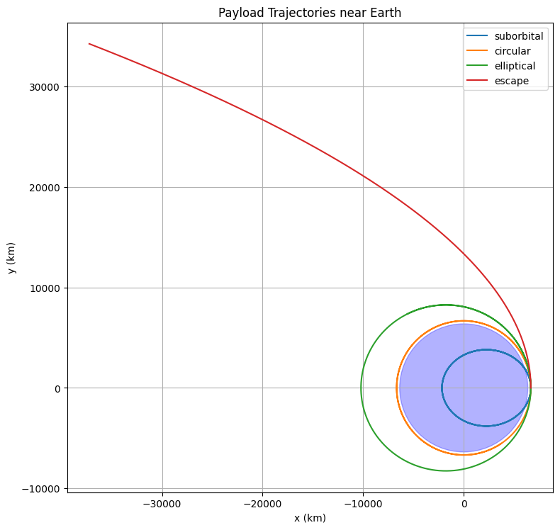

# Problem 3

# # Trajectories of a Freely Released Payload Near Earth

## Motivation
The trajectory of an object released from a moving rocket depends on its initial velocity and the gravitational influence of Earth. By analyzing these trajectories, we can understand orbital insertion, reentry paths, or escape scenarios. This knowledge is essential in space mission planning, satellite deployment, and reentry vehicle design.

---

## Physics Background

### Newton's Law of Gravitation:

$$
F = \frac{GMm}{r^2} \Rightarrow a = \frac{GM}{r^2} 
$$

This acceleration acts towards the center of Earth.

### Types of Trajectories
- **Circular Orbit**: Object moves with constant speed in a circular path.
- **Elliptical Orbit**: Object is bound to Earth but not at a constant distance.
- **Parabolic Escape**: Minimum speed to escape Earth's gravity.
- **Hyperbolic Escape**: Object escapes Earth with excess velocity.
- **Suborbital Trajectory**: Falls back to Earth before completing an orbit.

---

### Initial Conditions and Solver
```python
import numpy as np
import matplotlib.pyplot as plt
from scipy.integrate import solve_ivp

# Sabitler
R_earth = 6371e3       # Dünya yarıçapı, metre
mu = 3.986e14          # Yerçekimi parametresi (GM), m^3/s^2

# Diferansiyel denklem: hareket denklemleri
def equations(t, y):
    x, vx, y_pos, vy = y
    r = np.sqrt(x**2 + y_pos**2)
    ax = -mu * x / r**3
    ay = -mu * y_pos / r**3
    return [vx, ax, vy, ay]

# Başlangıç yüksekliği ve hızlar
altitude = 300e3        # 300 km
r0 = R_earth + altitude

v_circular = np.sqrt(mu / r0)  # Dairesel yörünge hızı

initial_conditions = {
    'suborbital': 0.7 * v_circular,
    'circular': v_circular,
    'elliptical': 1.1 * v_circular,
    'escape': np.sqrt(2) * v_circular,
}

fig, ax = plt.subplots(figsize=(8,8))

for label, vy0 in initial_conditions.items():
    y0 = [r0, 0, 0, vy0]  # [x, vx, y, vy]
    t_span = [0, 10000]
    t_eval = np.linspace(*t_span, 5000)
    sol = solve_ivp(equations, t_span, y0, t_eval=t_eval, rtol=1e-8)
    
    # Yeryüzüne girmemesi için, yörüngede r < R_earth olduğunda durabiliriz (isteğe bağlı)
    r = np.sqrt(sol.y[0]**2 + sol.y[2]**2)
    idx = np.where(r < R_earth)[0]
    if len(idx) > 0:
        cutoff = idx[0]
        x = sol.y[0][:cutoff]
        y_pos = sol.y[2][:cutoff]
    else:
        x = sol.y[0]
        y_pos = sol.y[2]
    
    ax.plot(x / 1e3, y_pos / 1e3, label=label)

# Dünya'yı çiz
earth = plt.Circle((0, 0), R_earth / 1e3, color='blue', alpha=0.3)
ax.add_patch(earth)

ax.set_xlabel('x (km)')
ax.set_ylabel('y (km)')
ax.set_title('Payload Trajectories near Earth')
ax.set_aspect('equal')
ax.legend()
ax.grid(True)
plt.tight_layout()
plt.show()



---

## Applications in Space Missions
- **Orbital Insertion**: Matching circular or elliptical orbits for satellites.
- **Escape Trajectory**: Interplanetary missions (e.g., to Mars).
- **Reentry Design**: Predicting where a returning capsule will land.

---

## Conclusion
By changing the initial velocity of a payload, we observe distinct paths that help classify motion near Earth. Simulating these paths enhances our understanding of celestial mechanics and supports mission-critical decisions in aerospace engineering.

```python
radii = np.linspace(R_earth, R_earth + 2e6, 500)
v_orbit = np.sqrt(mu / radii) / 1e3      # km/s
v_escape = np.sqrt(2 * mu / radii) / 1e3 # km/s

plt.figure(figsize=(8, 5))
plt.plot((radii - R_earth) / 1e3, v_orbit, label='Orbital Velocity')
plt.plot((radii - R_earth) / 1e3, v_escape, label='Escape Velocity')
plt.xlabel('Altitude (km)')
plt.ylabel('Velocity (km/s)')
plt.title('Velocity vs Altitude Near Earth')
plt.legend()
plt.grid(True)
plt.tight_layout()
plt.show()
```


```python
x = np.linspace(-2e7, 2e7, 40)
y = np.linspace(-2e7, 2e7, 40)
X, Y = np.meshgrid(x, y)
R = np.sqrt(X**2 + Y**2)
ax = -mu * X / R**3
ay = -mu * Y / R**3

plt.figure(figsize=(7, 7))
plt.streamplot(X/1e6, Y/1e6, ax, ay, color=np.sqrt(ax**2 + ay**2), cmap='plasma')
earth = plt.Circle((0, 0), R_earth / 1e6, color='blue', alpha=0.3)
plt.gca().add_patch(earth)
plt.xlabel('X (10⁶ m)')
plt.ylabel('Y (10⁶ m)')
plt.title('Gravitational Vector Field Around Earth')
plt.grid(True)
plt.axis('equal')
plt.show()
```


