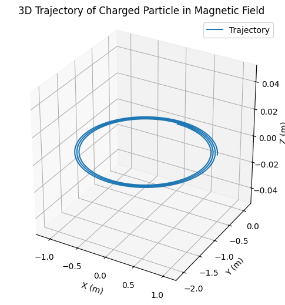
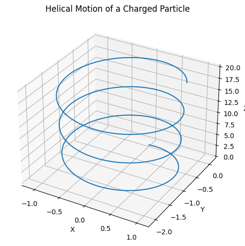
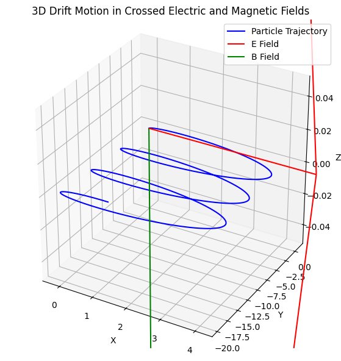

# Problem 1

# # Simulating the Effects of the Lorentz Force

## Motivation
The Lorentz force plays a fundamental role in electromagnetism, governing the motion of charged particles in electric and magnetic fields. Understanding this force is crucial in applications like particle accelerators, mass spectrometers, and plasma confinement systems.

---

## Key Equations
The Lorentz force equation is:

$$
 \vec{F} = q(\vec{E} + \vec{v} \times \vec{B}) 
 $$

Where:
$$
 q 
 $$
 
  = charge of the particle

$$
 \vec{E} 
 $$

  = electric field

$$
 \vec{B} 
 $$
 
  = magnetic field

$$
 \vec{v} 
 $$
 
  = velocity of the particle

---

## Imports
```python
import numpy as np
import matplotlib.pyplot as plt
from mpl_toolkits.mplot3d import Axes3D
```

---

## Lorentz Force Simulation (Euler Method)
```python
def lorentz_force(q, v, E, B):
    return q * (E + np.cross(v, B))

# Initialize arrays
r = np.zeros((N, 3))
v = np.zeros((N, 3))

# Set initial conditions
r[0] = r0
v[0] = v0

# Numerical integration
for i in range(1, N):
    a = lorentz_force(q, v[i-1], E, B) / m
    v[i] = v[i-1] + a * dt
    r[i] = r[i-1] + v[i] * dt
```

## Simulation Parameters
```python
import numpy as np
import matplotlib.pyplot as plt

# === Particle and Field Parameters ===
q = 1.0                        # Charge (C)
m = 1.0                        # Mass (kg)
E = np.array([0.0, 0.0, 0.0])  # Electric field (V/m)
B = np.array([0.0, 0.0, 1.0])  # Magnetic field (T)

# === Initial Conditions ===
r = np.array([0.0, 0.0, 0.0])  # Position (m)
v = np.array([1.0, 0.0, 0.0])  # Velocity (m/s)

# === Time Setup ===
dt = 0.01     # Time step (s)
T = 20        # Total time (s)
N = int(T / dt)

# === Data Storage for Trajectory ===
trajectory = np.zeros((N, 3))
time = np.linspace(0, T, N)

# === Simulation Loop ===
for i in range(N):
    # Save current position
    trajectory[i] = r

    # Lorentz force: F = q(E + v × B)
    force = q * (E + np.cross(v, B))
    
    # Acceleration
    a = force / m

    # Euler integration
    v += a * dt
    r += v * dt

# === 3D Plotting ===
fig = plt.figure(figsize=(8,6))
ax = fig.add_subplot(111, projection='3d')
ax.plot(trajectory[:, 0], trajectory[:, 1], trajectory[:, 2], label='Trajectory')

ax.set_xlabel('X (m)')
ax.set_ylabel('Y (m)')
ax.set_zlabel('Z (m)')
ax.set_title('3D Trajectory of Charged Particle in Magnetic Field')
ax.legend()
ax.grid(True)
ax.set_box_aspect([1,1,1])  # Equal aspect ratio for all axes

plt.show()

```


---

## 3D Trajectory Visualization
```python
fig = plt.figure(figsize=(10, 6))
ax = fig.add_subplot(111, projection='3d')
ax.plot(r[:,0], r[:,1], r[:,2], label='Particle Trajectory')
ax.set_xlabel('X')
ax.set_ylabel('Y')
ax.set_zlabel('Z')
ax.set_title('Charged Particle in Magnetic Field')
ax.legend()
plt.tight_layout()
plt.show()
```

---

## Observations and Physical Insight
- **Circular motion**: Occurs when only a magnetic field is present and the initial velocity is perpendicular to the field.
- **Helical motion**: Results from a velocity component both parallel and perpendicular to the magnetic field.
- **Drift motion**: Emerges when electric and magnetic fields are crossed.

### Larmor Radius:

$$
 r_L = \frac{mv_\perp}{qB} 
 $$

### Cyclotron Frequency:

$$
 \omega_c = \frac{qB}{m} 
 $$

---

## Extensions
- Add **non-uniform** magnetic fields.
- Include **relativistic corrections**.
- Simulate **plasma behavior** with multiple particles.

---

## Conclusion
This simulation gives insight into the fundamental behavior of charged particles under electromagnetic influence. Real-world applications span from fusion reactors to space plasma dynamics and particle beam control in accelerators.

```python
import numpy as np
import matplotlib.pyplot as plt
from mpl_toolkits.mplot3d import Axes3D

# Parameters
q = 1.0   # charge
m = 1.0   # mass
B = np.array([0, 0, 1.0])  # uniform magnetic field
E = np.array([0, 0, 0])    # no electric field
v0 = np.array([1.0, 0.0, 1.0])  # velocity with component along B
r0 = np.array([0.0, 0.0, 0.0])
dt = 0.01
T = 20
N = int(T / dt)

# Arrays
r = np.zeros((N, 3))
v = np.zeros((N, 3))
r[0], v[0] = r0, v0

def lorentz_force(v, E, B):
    return q * (E + np.cross(v, B))

# Integrate using Euler method
for i in range(1, N):
    a = lorentz_force(v[i-1], E, B) / m
    v[i] = v[i-1] + a * dt
    r[i] = r[i-1] + v[i] * dt

# 3D Plot
fig = plt.figure(figsize=(10,6))
ax = fig.add_subplot(111, projection='3d')
ax.plot(r[:,0], r[:,1], r[:,2])
ax.set_title('Helical Motion of a Charged Particle')
ax.set_xlabel('X')
ax.set_ylabel('Y')
ax.set_zlabel('Z')
plt.show()
```


```python
import numpy as np
import matplotlib.pyplot as plt

def lorentz_force(v, E, B, q=1.0):
    return q * (E + np.cross(v, B))

# Parameters
q = 1.0
m = 1.0
dt = 0.01
T = 20
N = int(T / dt)

r0 = np.array([0.0, 0.0, 0.0])
E = np.array([1.0, 0.0, 0.0])   # Electric field along x
B = np.array([0.0, 0.0, 1.0])   # Magnetic field along z
v0 = np.array([0.0, 1.0, 0.0])  # Initial velocity along y

# Initialize arrays
r = np.zeros((N, 3))
v = np.zeros((N, 3))
r[0], v[0] = r0, v0

# Time evolution
for i in range(1, N):
    a = lorentz_force(v[i-1], E, B, q) / m
    v[i] = v[i-1] + a * dt
    r[i] = r[i-1] + v[i] * dt

# 3D plot of trajectory
fig = plt.figure(figsize=(10,7))
ax = fig.add_subplot(111, projection='3d')
ax.plot(r[:,0], r[:,1], r[:,2], color='blue', label='Particle Trajectory')

# Add arrows for fields (scaled for visibility)
ax.quiver(0, 0, 0, E[0], E[1], E[2], color='red', length=5, normalize=True, label='E Field')
ax.quiver(0, 0, 0, B[0], B[1], B[2], color='green', length=5, normalize=True, label='B Field')

ax.set_xlabel('X')
ax.set_ylabel('Y')
ax.set_zlabel('Z')
ax.set_title('3D Drift Motion in Crossed Electric and Magnetic Fields')
ax.legend()
ax.grid(True)
ax.set_box_aspect([1,1,1])  # Equal axis scaling

plt.show()


```



