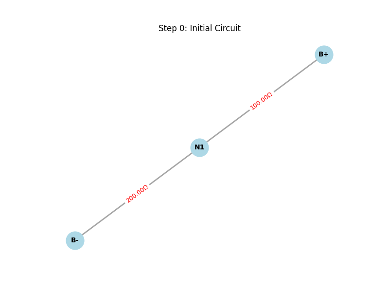
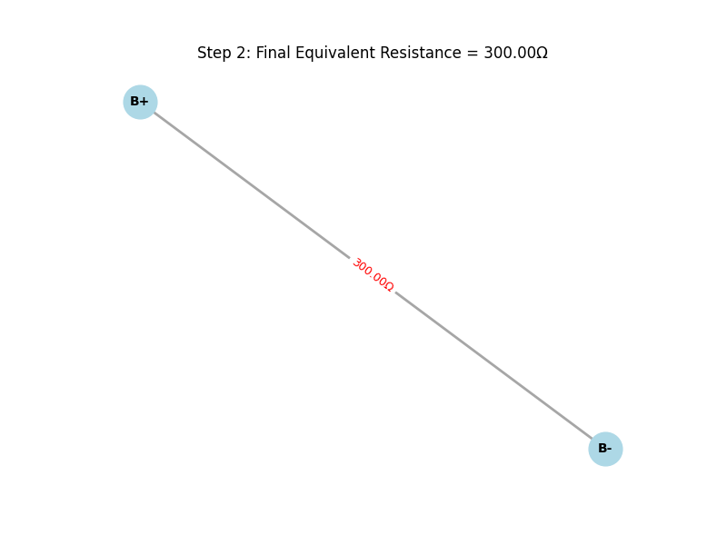
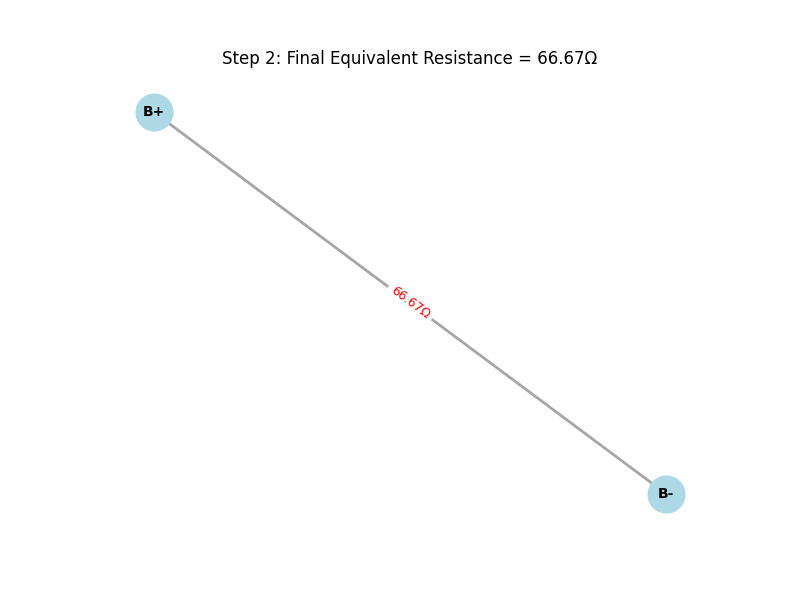
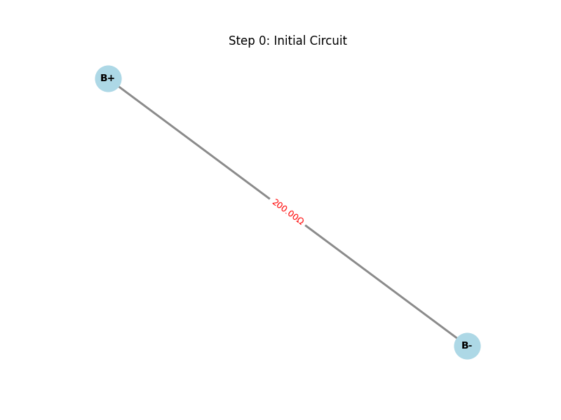

📘 Equivalent Resistance Using Graph Theory
🎯 Motivation
Calculating the equivalent resistance in an electrical circuit is a fundamental task in electrical engineering and physics. While traditional methods rely on manually applying series and parallel rules, graph theory provides a more scalable solution for complex resistor networks.

By modeling circuits as graphs — where nodes represent junctions and edges represent resistors — we can automate the reduction process.

🧠 Algorithm Overview
🔹 

Series Connection

If resistors are connected end-to-end:

Nodes:
B+, N1, B-

Resistors:

Node1: B+

Node2: N1

Value: 100

Node1: N1

Node2: B-

Value: 200

The total equivalent resistance will be 300 Ω (since 100 + 200 = 300 in series).

phyton

    def _combine_series_threaded(self, G, step_count):

    changed = False
    nodes_to_remove = []
    edges_to_add = []
    r1_val = 0
    r2_val = 0

    for node in list(G.nodes()):
        if G.degree(node) == 2 and node not in ("B+", "B-"):
            neighbors = list(G.neighbors(node))
            if len(neighbors) == 2:
                u, v = neighbors[0], neighbors[1]
                # u-v arasında doğrudan bağlantı yoksa
                if G.number_of_edges(u, v) == 0:
                    edge1_data = G.get_edge_data(u, node)
                    edge2_data = G.get_edge_data(node, v)
                    r1_val = next(iter(edge1_data.values()))['resistance']
                    r2_val = next(iter(edge2_data.values()))['resistance']
                    R_new = r1_val + r2_val
                    nodes_to_remove.append(node)
                    edges_to_add.append((u, v, R_new, f"series_{step_count}_{node}"))
                    changed = True
                    break

    if changed:
        for node in nodes_to_remove:
            G.remove_node(node)
        for u, v, R_new, key in edges_to_add:
            G.add_edge(u, v, resistance=R_new, key=key)
            step_count += 1
            self.update_status_signal.emit(f"Series combination: {u}-{nodes_to_remove[0]}-{v} combined. New resistance: {R_new:.2f}Ω")
            self._draw_and_save_graph(G, f"Step {step_count}: Series {u}-{v} = {R_new:.2f}Ω ({r1_val:.2f}Ω + {r2_val:.2f}Ω)", step_count)
    return step_count, changed
 

def parallel_circuit(*resistances):

    inverse_sum = sum(1 / r for r in resistances)
    return 1 / inverse_sum
🔄 Iterative Reduction Steps
Identify and combine series-connected resistors.

Identify and combine parallel-connected resistors.

+
Repeat until one equivalent resistance remains.

▶ Example 2: Parallel

B+, B-
B+ - B-: 100 Ω
B+ - B-: 200 Ω

1 / Req = 1/100 + 1/200 → Req = 66.67 Ω

python

    def _combine_parallel_threaded(self, G, step_count):
    changed = False
    edges_to_remove = []
    edges_to_add = []

    
    for u in list(G.nodes()):
        for v in list(G.nodes()):
            if u == v:
                continue
            if G.number_of_edges(u, v) > 1:
                resistances = [data['resistance'] for key, data in G.get_edge_data(u, v).items()]
                try:
                    inverse_sum = sum(1 / r for r in resistances if r != 0)
                    R_parallel = 1 / inverse_sum if inverse_sum != 0 else 0
                except ZeroDivisionError:
                    R_parallel = 0
                for key in list(G.get_edge_data(u, v).keys()):
                    edges_to_remove.append((u, v, key))
                edges_to_add.append((u, v, R_parallel, f"parallel_{step_count}_{u}_{v}"))
                changed = True
                break
        if changed:
            break

    if changed:
        for u, v, key in edges_to_remove:
            G.remove_edge(u, v, key)
        for u, v, R_parallel, key in edges_to_add:
            G.add_edge(u, v, resistance=R_parallel, key=key)
            step_count += 1
            self.update_status_signal.emit(f"Parallel combination: Resistors between {u}-{v} combined. New resistance: {R_parallel:.2f}Ω")
            self._draw_and_save_graph(G, f"Step {step_count}: Parallel {u}-{v} = {R_parallel:.2f}Ω", step_count)
    return step_count, changed

Example 3: Nested
lua

A --2Ω--+--B--4Ω--+--C
        |        |
        3Ω       6Ω
        |        |
        +--------+
Steps:

4Ω and 6Ω → parallel: 2.4Ω

Series: 3 + 2.4 = 5.4Ω

Total: 2 + 5.4 = 7.4Ω

📊 Time & Space Complexity
Time: 𝑂(E)

Space: 𝑂(V + E)

🚀 Future Improvements
Graph traversal (DFS/BFS)

Caching repeated subgraphs

GUI or interactive input

